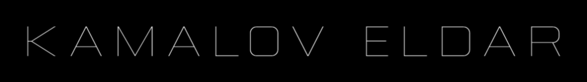

### :man_technologist: Обо мне:

Мой стек: React, Next.js, Redux Toolkit, Mobx, RTK Query, webpack, unit тесты, storybook, UIKit библиотеки.

Взаимодействие с backend через RESTful API, WebSocket.

### 🤝 Социальные сети:

....

<!--  -->

---

### Frontend developer skills:

---

## Навыки и технологии

### 🛠️ Основные технологии

| HTML5 | CSS3 | JavaScript | TypeScript | Git |
| --- | --- | --- | --- | --- |
|  |  |  |  |  |

### 📚 Фреймворки и библиотеки

| React | NextJS | Redux | MobX | Storybook |
| --- | --- | --- | --- | --- |
|  |  |  |  |  |

### 🎨 Стилизация

| Material UI | Tailwind CSS | Styled Components | Sass |
| --- | --- | --- | --- |
|  |  |  |  |

### 🧪 Инструменты разработки

| Webpack | Jest | Figma |
| --- | --- | --- |
|  |  |  |

### 💻 Codewars:

### ⚙️ GitHub статистика:

<table>
  <tr>
    <td>
      
    </td>
    <td>
      
    </td>
  </tr>
</table>

